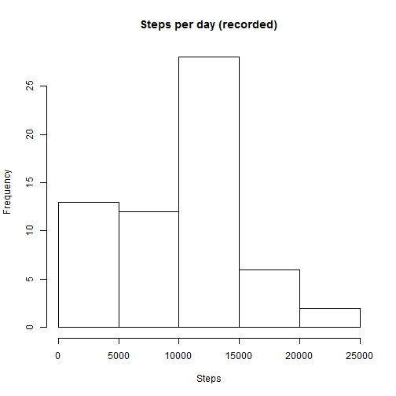
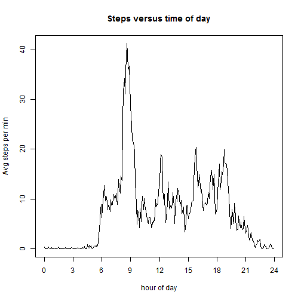
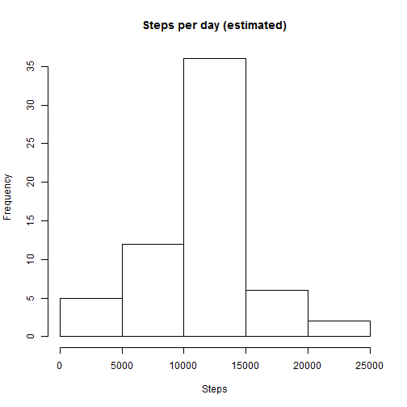
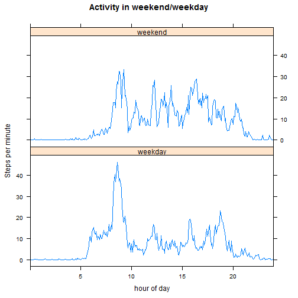

This assignment makes use of data from a personal activity monitoring device. This device collects data at 5 minute intervals through out the day. The data consists of two months of data from an anonymous individual collected during the months of October and November, 2012 and include the number of steps taken in 5 minute intervals each day.


## Loading and preprocessing the data

First of all we set the seed for any random processing and load
any libraries we will need.


```r
set.seed(1)
library(plyr,       verbose=FALSE, warn.conflicts=FALSE)
library(dplyr,      verbose=FALSE, warn.conflicts=FALSE)
library(data.table, verbose=FALSE, warn.conflicts=FALSE)
library(ggplot2,    verbose=FALSE, warn.conflicts=FALSE)
library(lattice,    verbose=FALSE, warn.conflicts=FALSE)
library(lubridate,  verbose=FALSE, warn.conflicts=FALSE)
```

We then read the data from the "activity.csv" spreadsheet in the default directory.


```r
mytab <-read.csv("activity.csv")
```

We now transform the data so that we have a table called "dt" with the following columns.

- steps: Number of steps taking in a 5-minute interval (missing values are coded as NA)

- date: The date on which the measurement took place in POSIX date format

- interval: Identifier for the 5-minute interval in which measurement was taken

- time: start time of interval in POSIX time format

- interval.idx: index of interval within current day (start value=0)


```r
mytime<-paste(mytab$date, sprintf("%4.4d00", mytab$interval))

dt<-data.table(  date      =ymd(mytab$date)
               , interval  =mytab$interval
               , time      =ymd_hms(mytime)
               , steps     =mytab$steps               
               )

dt$interval.idx <- as.numeric(difftime(dt$time,dt$date, units="mins")/5)
```

Here is a summary of the table "dt" that we have created.


```r
summary(dt)
```

```
##       date               interval           time                    
##  Min.   :2012-10-01   Min.   :   0.0   Min.   :2012-10-01 00:00:00  
##  1st Qu.:2012-10-16   1st Qu.: 588.8   1st Qu.:2012-10-16 05:58:45  
##  Median :2012-10-31   Median :1177.5   Median :2012-10-31 11:57:30  
##  Mean   :2012-10-31   Mean   :1177.5   Mean   :2012-10-31 11:57:30  
##  3rd Qu.:2012-11-15   3rd Qu.:1766.2   3rd Qu.:2012-11-15 17:56:15  
##  Max.   :2012-11-30   Max.   :2355.0   Max.   :2012-11-30 23:55:00  
##                                                                     
##      steps         interval.idx   
##  Min.   :  0.00   Min.   :  0.00  
##  1st Qu.:  0.00   1st Qu.: 71.75  
##  Median :  0.00   Median :143.50  
##  Mean   : 37.38   Mean   :143.50  
##  3rd Qu.: 12.00   3rd Qu.:215.25  
##  Max.   :806.00   Max.   :287.00  
##  NA's   :2304
```


## What is mean total number of steps taken per day?


Calculate the total number of steps taken per day in a new table "dt.daily" and use this to
make a histogram of the total number of steps taken each day.


```r
dt.daily<-ddply(dt,.(date), summarize, steps=sum(steps, na.rm=TRUE))

hist(dt.daily$steps, xlab="Steps", main="Steps per day (recorded)" )
```

 


Here is the median and the mean (and a couple of other properties)
of the number of steps taken per day.


```r
summary(dt.daily$steps)
```

```
##    Min. 1st Qu.  Median    Mean 3rd Qu.    Max. 
##       0    6778   10400    9354   12810   21190
```

## What is the average daily activity pattern?

We create a table listing the the average activity per 5 minute time slot.


```r
dt3=ddply(dt,.(interval.idx), summarize, steps=mean(steps, na.rm=TRUE))
```

This allows us to display  a time series plot of the 5-minute interval (x-axis) and the average number of steps taken, averaged across all days (y-axis). The steps have been normalized to the average steps per minute.


```r
plot(  dt3$interval.idx *5 /60 
     , dt3$steps/5
     , type="l"
     , xlab="hour of day"
     , ylab="Avg steps per min"
     , main="Steps versus time of day"
     , xaxt="n"
     )
axis(side=1, at=seq(0,24, by= 3))
```

 

The following code shows that the  5-minute interval, on average, containing the maximum number of steps is between 8:35 and 8:40.


```r
dt[which.max(dt3$steps)]$interval
```

```
## [1] 835
```

## Imputing missing values

Note that there are a number of days/intervals where there are missing values (coded as NA). The presence of missing days may introduce bias into some calculations or summaries of the data.

There are 2304 missing values in the dataset as shown by the following code.

```r
sum(is.na(dt$steps))
```

```
## [1] 2304
```

We fill the missing values with the average value for that timeslot over the days  sampled.


```r
dt$steps2 <- ifelse(is.na(dt$steps),dt3$steps[dt$interval.idx+1], dt$steps)
dt.daily2=ddply(dt,.(date), summarize, steps=sum(steps2, na.rm=TRUE))
```


Here is a histogram of the (new) total number of steps taken each day.


```r
hist(dt.daily2$steps, xlab="Steps", main="Steps per day (estimated)" )
```

 


Here is the median and the mean (and a couple of other properties)
of the number of steps taken per day.


```r
summary(dt.daily2$steps)
```

```
##    Min. 1st Qu.  Median    Mean 3rd Qu.    Max. 
##      41    9819   10770   10770   12810   21190
```

We see that the new values that have been filled in have caused the median and 
mean to increase. There are less time slots that defaulted to zero in the 
inplicit calculation of the daily totals.

The fact that the median is now equal to the mean is a quirk of the data set. Several days consisted totally of NA values and these got estimated at the new daily average. These would be roughly in the middle of the rankings. In this actual case one of them was the median day!


## Are there differences in activity patterns between weekdays and weekends?

We create another column indicating whether the day falls in the weekend. We use this to create a planel plot that compares the average activity in the weekend to a weekday.


```r
dt$daytype <- ifelse(weekdays(dt$date) %in% c("Saturday","Sunday"), "weekend", "weekday")


dt6=ddply(dt
          ,.(interval.idx,daytype)
          ,summarize
          , steps=mean(steps2, na.rm=TRUE)/5)
dt6$hour<-dt6$interval.idx/12


xyplot(steps~hour|daytype
       , data=dt6
       , xlab="hour of day"
       , ylab="Steps per minute"
       , main="Activity in weekend/weekday"
       , type="l"
       , xlim=c(0,24)
       ,layout=c(1,2)
       )
```

 

We see that people usually get up earlier on a weekday! They stay up later in the weekend. From 6am to 9am people are more active on a weekday. The rest of the day they are more active in the weekend.
